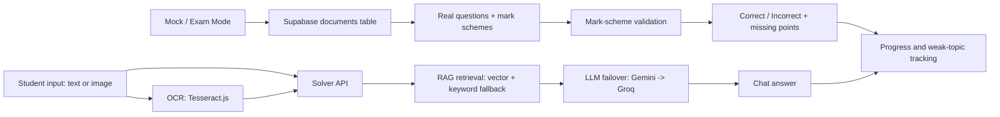

# ScholarHAAB

ScholarHAAB is an AI-powered personalized learning platform for exam-focused students, built for the Education (EdTech) track: adaptive, inclusive, scalable AI learning ecosystems.

The product focuses on a simple belief: students in Bangladesh and other emerging markets should not need expensive private tutoring to get personalized exam support. ScholarHAAB combines real past-paper data, mark schemes, OCR, RAG, LLM tutoring, progress analytics, and adaptive practice into one cloud-native learning system.

Live deployment: https://scholar-haab.vercel.app

## Hackathon Positioning

**Track:** Education (EdTech)  
**Category:** AI-Powered Personalized Learning Systems  
**Strategic theme:** Adaptive, inclusive, scalable AI learning ecosystems  
**Primary users:** O Level, A Level, IGCSE, and exam-track students; later teachers, schools, and rural learning centers.

## Problem

Students face three connected barriers:

- **Learning inequality:** high-quality tutoring is expensive and concentrated in cities.
- **Lack of personalization:** every student gets the same class, even when their gaps are different.
- **Exam pressure:** students need mark-scheme aligned answers, not generic explanations.
- **Skill mismatch:** learners often do not know which topics, weak points, and next practice steps matter most.

In Bangladesh this appears as overcrowded classrooms, private tutor dependency, English/Bangla learning friction, and uneven access to past-paper guidance. Globally, the same pattern appears across emerging markets where scalable teacher support is limited.

## Solution

ScholarHAAB is a student-first AI learning assistant with:

- **Solver:** ChatGPT-style doubt solving with text or image upload, OCR, RAG retrieval, LLM answer generation, Markdown, and LaTeX rendering.
- **Exam Mode:** Real past-paper questions from the database using direct metadata filters.
- **Mock Test Mode:** Database-first mock tests. Students choose subject, topic, and question count; the app loads real questions and validates answers against real mark schemes.
- **Adaptive Mode:** Generates exam-style practice from retrieved academic patterns.
- **QBank:** Topic and concept exploration from indexed academic material.
- **Skipped Topic Support:** Alternative explanations for topics the student is avoiding or confused by.
- **Dashboard:** User profile, activity, weak topics, and progress tracking.

The newest product direction is intentionally database-first for assessment: real questions and real mark schemes are prioritized over generated content.

## What Makes ScholarHAAB Different

- **Past-paper aligned:** answers and mock feedback are grounded in actual exam data and mark schemes.
- **AI where it matters:** LLMs explain, grade equivalence, and tutor; they do not replace source-of-truth exam content.
- **RAG + direct DB:** conversational solving uses retrieval; assessment flows use simple direct database queries for reliability.
- **Rural-first potential:** text-first UI, low-bandwidth flows, mobile responsiveness, and future Bangla localization.
- **Teacher-ready:** the same architecture can power teacher copilots, weak-topic dashboards, and class-level intervention reports.

## Core User Flows

### 1. Solver

Input:
- Typed question
- Uploaded image of a question

Flow:
1. OCR extracts image text when needed.
2. Query is passed to the solver API.
3. RAG retrieves academic/past-paper context where relevant.
4. Gemini is used first; Groq is used as fallback.
5. The assistant replies in a clean chat interface.

Output:
- Direct answer
- Step-by-step explanation
- Markdown and LaTeX rendering
- Conversation history in the UI

### 2. Exam Mode

Input:
- Subject
- Topic

Flow:
1. API queries the `documents` table directly.
2. It filters by `metadata->>'subject'`, `metadata->>'topic'`, and `metadata->>'type' = 'past_paper'`.
3. If strict metadata has no match, it falls back to a broader subject/topic metadata search.
4. The UI displays real questions and mark scheme toggles.

Output:
- Real past-paper questions
- Real mark scheme answers

### 3. Mock Test Mode

Input:
- Subject
- Topic
- Number of questions, 1-10

Flow:
1. API fetches real past-paper questions from `documents`.
2. Student answers one question at a time.
3. Grading uses the real mark scheme as the source of truth.
4. LLM validation may judge equivalent wording, but the displayed solution remains the stored mark scheme.

Output:
- Correct/Incorrect
- Score
- Matched mark points
- Missing mark points
- Mark scheme solution

### 4. Adaptive Practice

Input:
- Subject
- Topic
- Difficulty/performance signals

Flow:
1. The system retrieves topic evidence.
2. It creates practice aligned to the retrieved academic pattern.
3. It stores generated questions for future progress analysis.

Output:
- New practice question
- Step-by-step answer
- Common mistakes

## AI Architecture



### Retrieval

- Primary vector RPC: `match_documents`
- Threshold default: `0.65`
- Keyword fallback: PostgreSQL keyword search / metadata filters
- Direct DB mode for exam and mock assessments

### LLM

- Primary: Gemini
- Fallback: Groq
- Retry attempts: 3
- Timeout default: 15 seconds per attempt
- JSON repair path for structured outputs

### Data Layer

Main source table:
- `documents`
- `content`
- `metadata`
- `embedding`
- `source_title`
- `source_kind`

Application tables:
- `profiles`
- `conversations`
- `user_progress`
- `generated_questions`
- `mock_attempts`

## Personalization Logic

ScholarHAAB personalizes through:

- User profile: board, level, subject preferences, setup state.
- Learning history: conversations, mock attempts, solved topics.
- Weak-topic tracking: correct/incorrect patterns by topic.
- Adaptive difficulty: future practice can be adjusted using previous performance.
- Skipped-topic detection: students get alternate explanations when they struggle.

## Curriculum Alignment

The platform is built around:

- Board and level metadata.
- Past-paper documents.
- Mark schemes.
- Topic tags.
- Question numbers, years, papers, and source titles where available.

This makes the experience exam-aligned instead of generic.

## Accessibility and Localization

Current:
- Mobile responsive pages.
- Text-first learning workflows.
- Image upload for students who prefer taking photos of printed questions.
- Clear dark UI with high contrast brand colors.

Planned:
- Bangla explanation mode.
- Low-bandwidth mode.
- Teacher classroom mode.
- Audio explanations.
- Offline-first question packs for rural learning centers.

## Impact Measurement

Suggested KPIs:

- Learning improvement: target 20-35% increase in topic quiz accuracy after repeated practice.
- Dropout reduction: track weekly return rate and weak-topic completion.
- Skill certification: topic mastery badges or micro-credentials after mark-scheme verified attempts.
- Tutor reach: number of students served per teacher or school.
- Response quality: percentage of answers grounded in retrieved or direct database evidence.

## Scalability

ScholarHAAB is designed as a modular learning engine:

- Next.js app router frontend and APIs.
- Supabase auth, database, and pgvector.
- Cloud-native deployment on Vercel.
- Pluggable LLM providers.
- Modular curriculum ingestion pipeline.
- Extensible QBank and concept graph modules.
- Future multilingual layer.

## Tech Stack

- Next.js 16 App Router
- React 19
- TypeScript
- Supabase Auth + Database + pgvector
- Gemini API
- Groq API fallback
- Tesseract.js OCR
- KaTeX / React KaTeX
- Lucide icons
- Vercel deployment

## Important Routes

- `/` landing page
- `/login`
- `/register`
- `/setup`
- `/dashboard`
- `/solver`
- `/exam-mode`
- `/mock`
- `/adaptive-mode`
- `/qbank`
- `/skipped`
- `/profile`

## Environment Variables

Create `.env.local` using the project examples:

- `NEXT_PUBLIC_SUPABASE_URL`
- `NEXT_PUBLIC_SUPABASE_ANON_KEY`
- `SUPABASE_SERVICE_ROLE_KEY`
- `GEMINI_API_KEY`
- `GROQ_API_KEY`
- `LLM_TIMEOUT_MS`
- `LLM_RETRY_ATTEMPTS`
- `RAG_MATCH_THRESHOLD`

## Local Development

```bash
npm install
npm run dev
```

Build:

```bash
npm run build
```

Deploy:

```bash
npx vercel --prod --yes
```

## Quality Gates

Useful commands:

```bash
npx tsc --noEmit --pretty false
npm run build
npm run test:knowledge
npm run test:ai-service
npm run test:regressions
```

## BuildFest Pitch Summary

ScholarHAAB is not just a chatbot. It is an AI learning infrastructure layer for exam preparation in emerging markets:

- Real past-paper questions.
- Real mark schemes.
- RAG-grounded tutoring.
- AI grading against source truth.
- Student progress analytics.
- Future Bangla and low-bandwidth learning.

The vision is to become the most accessible personalized exam tutor for Bangladesh first, then scale to other exam-heavy education systems worldwide.
